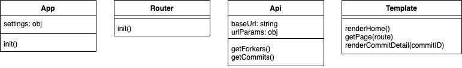
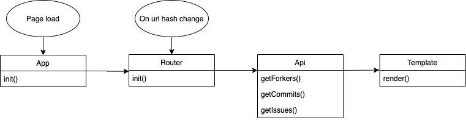
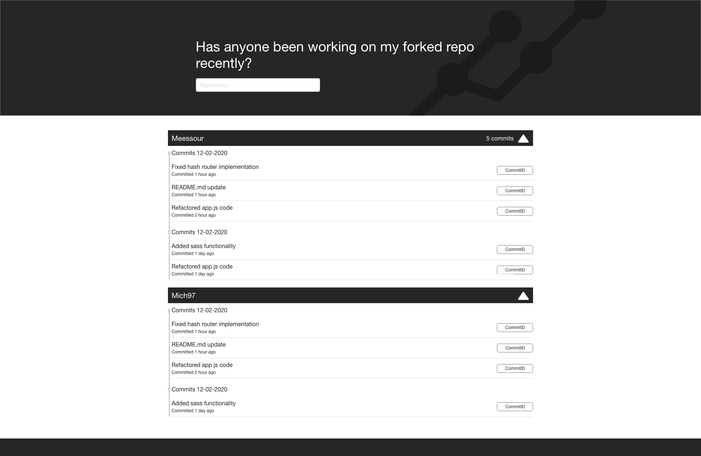
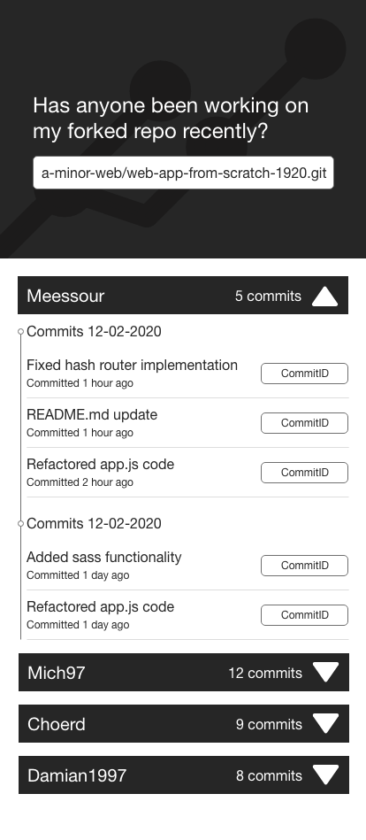
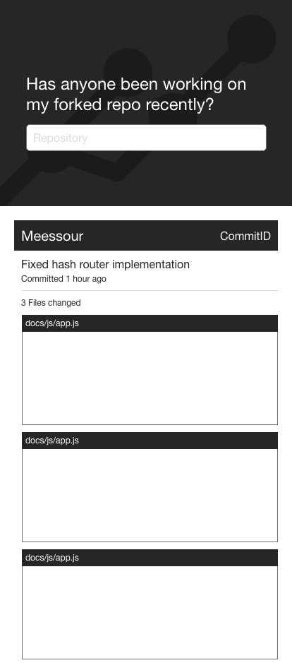

# Web app from scratch - CMD Minor 1920
Repository for the Web app from scratch course.

[Demo](https://pensive-edison-bc4991.netlify.com/)

* [Description](#description)
* [Installing](#installing)
	* [Packages](#packages)
* [Api](#api)
* [How it works](#how-it-works)
	* [Actor diagram](#actor-diagram)
	* [Interaction diagram](#interaction-diagram)
* [UI Design](#ui-design)
* [Sources](#sources)
* [Honourable mentions](#honourable-mentions)
* [License](#license)

## Description
With this application you can get insight into who has forked your repository and if they have done any work on your project.

## Installing

To install this application localy type the following into your terminal
```
git clone https://github.com/damian1997/web-app-from-scratch-1920.git
npm install
```

To serve the application to your browser type the following into your terminal
```
npm run dev
```

To generate production files type the following into your terminal
```
npm run prod
```

### Installing firebase microservices localy
For this project i have written a html scraper that is hosted on firebase, to test this localy follow the following steps.

Type the folowing in your terminal when you are in your local project repository.
```
cd functions
npm install
```

To run the microservice on localhost type the following when you are inside the functions directory.
```
npm run serve
```

If you have assigned a different name to your local repository you have to change the fetch url inside app.mjs.
```javascript
const res = await fetch('http://localhost:5000/web-app-from-scratch-f6a7f/us-central1/scraper', {
	method: 'POST',
	body: JSON.stringify(`https://api.github.com/repos/${splitstr[0]}/${splitstr[1]}/commits/${splitstr[2]}`)
})
```

Now your project dev server and the firebase server is running on localhost and you can make use of the html scraper.

### Packages
This project makes use of the following packages and technologies:
* [Webpack](https://webpack.js.org/)
* [Firebase](https://firebase.google.com/docs/web/setup?gclid=CjwKCAiAy9jyBRA6EiwAeclQhL8tUJSOZmknToT8hktxYZwUKbhYftfGix5JuM2zRjxJ2aypbgdDfBoCgIMQAvD_BwE)

## Api
This project makes use of the following Api
* [Github Api V3](https://developer.github.com/v3/)

### Rate limiting
For API requests using Basic Authentication or OAuth, you can make up to 5000 requests per hour. Authenticated requests are associated with the authenticated user, regardless of whether [Basic authentication](For API requests using Basic Authentication or OAuth, you can make up to 5000 requests per hour. Authenticated requests are associated with the authenticated user, regardless of whether Basic Authentication or an OAuth token was used.) or an [OAuth](https://developer.github.com/v3/#oauth2-token-sent-in-a-header) was used.

For unauthenticated requests, the rate limit allows for up to 60 requests per hour. Unauthenticated requests are associated with the originating IP address, and not the user making requests.

#### Used authentication
This project currentcly fetched data with unauthenticates requests.

***

#### Fetch forkers output
When fetching forkers the api outputs the following

<details>
 <summary>Show output</summary>

 ```json

 [
    {
        "gitusername": "meessour",
        "repository": "web-app-from-scratch-1920"
    },
    {
        "gitusername": "DanielvandeVelde",
        "repository": "web-app-from-scratch-1920"
    },
    {
        "gitusername": "Jaouad90",
        "repository": "GarbageScraper"
    },
    {
        "gitusername": "TimTerwijn",
        "repository": "web-app-from-scratch-1920"
    },
    {
        "gitusername": "LarsBreuren",
        "repository": "web-app-from-scratch-1920"
    },
    {
        "gitusername": "heralt",
        "repository": "web-app-from-scratch-1920"
    },
    {
        "gitusername": "lennartdeknikker",
        "repository": "web-app-from-scratch-1920"
    },
    {
        "gitusername": "thijsbordewijk",
        "repository": "web-app-from-scratch-1920"
    },
    {
        "gitusername": "Mokerstier",
        "repository": "web-app-from-scratch-1920"
    },
    {
        "gitusername": "randy554",
        "repository": "web-app-from-scratch-1920"
    },
    {
        "gitusername": "Zeijls",
        "repository": "web-app-from-scratch-1920"
    },
    {
        "gitusername": "TomasS666",
        "repository": "web-app-from-scratch-1920"
    },
    {
        "gitusername": "MohamadAlGhorani",
        "repository": "web-app-from-scratch-1920"
    },
    {
        "gitusername": "mordock",
        "repository": "web-app-from-scratch-1920"
    },
    {
        "gitusername": "ReiniervanLimpt",
        "repository": "web-app-from-scratch-1920"
    },
    {
        "gitusername": "Coenmathijssen",
        "repository": "web-app-from-scratch-1920"
    },
    {
        "gitusername": "charder001",
        "repository": "web-app-from-scratch-1920"
    },
    {
        "gitusername": "jenniferslagt",
        "repository": "web-app-from-scratch-1920"
    },
    {
        "gitusername": "Ramon96",
        "repository": "web-app-from-scratch-1920"
    },
    {
        "gitusername": "iSirThijs",
        "repository": "web-app-from-scratch-1920"
    },
    {
        "gitusername": "marissaverdonck",
        "repository": "web-app-from-scratch-1920"
    },
    {
        "gitusername": "martendebruijn",
        "repository": "web-app-from-scratch-1920"
    },
    {
        "gitusername": "CountNick",
        "repository": "web-app-from-scratch-1920"
    },
    {
        "gitusername": "Stanargy",
        "repository": "web-app-from-scratch-1920"
    },
    {
        "gitusername": "qiubee",
        "repository": "web-app-from-scratch-1920"
    },
    {
        "gitusername": "robert-hoekstra",
        "repository": "web-app-from-scratch-1920"
    },
    {
        "gitusername": "Aidan98",
        "repository": "web-app-from-scratch-1920"
    },
    {
        "gitusername": "tnanhekhan",
        "repository": "web-app-from-scratch-1920"
    },
    {
        "gitusername": "gijslaarman",
        "repository": "web-app-from-scratch-1920"
    },
    {
        "gitusername": "MonikaaS",
        "repository": "web-app-from-scratch-1920"
    }
]

 ```
</details>

***

#### Fetch commits for every forker
After fetching everyone who forked the repo we go and fetch all the commits they have made on their repository, below is an example output for 1 of the forkers.

<details>
 <summary>Show output</summary>

 ```json

 {
    "gitusername": "meessour",
    "repository": "web-app-from-scratch-1920",
    "commits": [
        {
            "sha": "73cac56178a0549a5a2d4f29f001f99a13ffb577",
            "node_id": "MDY6Q29tbWl0MjM4MDMxNDU1OjczY2FjNTYxNzhhMDU0OWE1YTJkNGYyOWYwMDFmOTlhMTNmZmI1Nzc=",
            "commit": {
                "author": {
                    "name": "msourHvA",
                    "email": "meessour@gmail.com",
                    "date": "2020-02-11T19:29:58Z"
                },
                "committer": {
                    "name": "msourHvA",
                    "email": "meessour@gmail.com",
                    "date": "2020-02-11T19:29:58Z"
                },
                "message": "Added routing. Added show songs of artist on click. Fixed visuals",
                "tree": {
                    "sha": "77e8eec5096cca51029ad7bcf44d96e4d1f7f5ae",
                    "url": "https://api.github.com/repos/meessour/web-app-from-scratch-1920/git/trees/77e8eec5096cca51029ad7bcf44d96e4d1f7f5ae"
                },
                "url": "https://api.github.com/repos/meessour/web-app-from-scratch-1920/git/commits/73cac56178a0549a5a2d4f29f001f99a13ffb577",
                "comment_count": 0,
                "verification": {
                    "verified": false,
                    "reason": "unsigned",
                    "signature": null,
                    "payload": null
                }
            },
            "url": "https://api.github.com/repos/meessour/web-app-from-scratch-1920/commits/73cac56178a0549a5a2d4f29f001f99a13ffb577",
            "html_url": "https://github.com/meessour/web-app-from-scratch-1920/commit/73cac56178a0549a5a2d4f29f001f99a13ffb577",
            "comments_url": "https://api.github.com/repos/meessour/web-app-from-scratch-1920/commits/73cac56178a0549a5a2d4f29f001f99a13ffb577/comments",
            "author": {
                "login": "meessour",
                "id": 32935392,
                "node_id": "MDQ6VXNlcjMyOTM1Mzky",
                "avatar_url": "https://avatars3.githubusercontent.com/u/32935392?v=4",
                "gravatar_id": "",
                "url": "https://api.github.com/users/meessour",
                "html_url": "https://github.com/meessour",
                "followers_url": "https://api.github.com/users/meessour/followers",
                "following_url": "https://api.github.com/users/meessour/following{/other_user}",
                "gists_url": "https://api.github.com/users/meessour/gists{/gist_id}",
                "starred_url": "https://api.github.com/users/meessour/starred{/owner}{/repo}",
                "subscriptions_url": "https://api.github.com/users/meessour/subscriptions",
                "organizations_url": "https://api.github.com/users/meessour/orgs",
                "repos_url": "https://api.github.com/users/meessour/repos",
                "events_url": "https://api.github.com/users/meessour/events{/privacy}",
                "received_events_url": "https://api.github.com/users/meessour/received_events",
                "type": "User",
                "site_admin": false
            },
            "committer": {
                "login": "meessour",
                "id": 32935392,
                "node_id": "MDQ6VXNlcjMyOTM1Mzky",
                "avatar_url": "https://avatars3.githubusercontent.com/u/32935392?v=4",
                "gravatar_id": "",
                "url": "https://api.github.com/users/meessour",
                "html_url": "https://github.com/meessour",
                "followers_url": "https://api.github.com/users/meessour/followers",
                "following_url": "https://api.github.com/users/meessour/following{/other_user}",
                "gists_url": "https://api.github.com/users/meessour/gists{/gist_id}",
                "starred_url": "https://api.github.com/users/meessour/starred{/owner}{/repo}",
                "subscriptions_url": "https://api.github.com/users/meessour/subscriptions",
                "organizations_url": "https://api.github.com/users/meessour/orgs",
                "repos_url": "https://api.github.com/users/meessour/repos",
                "events_url": "https://api.github.com/users/meessour/events{/privacy}",
                "received_events_url": "https://api.github.com/users/meessour/received_events",
                "type": "User",
                "site_admin": false
            },
            "parents": [
                {
                    "sha": "a90db6d862f4d58b444e251aa00671d364d716ba",
                    "url": "https://api.github.com/repos/meessour/web-app-from-scratch-1920/commits/a90db6d862f4d58b444e251aa00671d364d716ba",
                    "html_url": "https://github.com/meessour/web-app-from-scratch-1920/commit/a90db6d862f4d58b444e251aa00671d364d716ba"
                }
            ]
		},
    ]
}

 ```

 </details>

 ***

## How it works
### Actor diagram


### Flow diagram


## UI Design

### Desktop

Home page when launching the application



Commit detail page


### Mobile

Home page when launching the application



Commit detail page



## Sources
* [MDN](https://developer.mozilla.org/nl/)
* [Github Api documentation](https://developer.github.com/v3/)

## Honourable mentions
Special thanks to [Thijs](https://github.com/iSirThijs/web-app-from-scratch-1920) who was of huge help with building the virtualdom and getting my head wrapped around the concept of a vdom.

## License
[MIT License](https://github.com/damian1997/web-app-from-scratch-1920/blob/master/LICENSE) [Damian1997](https://github.com/damian1997)
