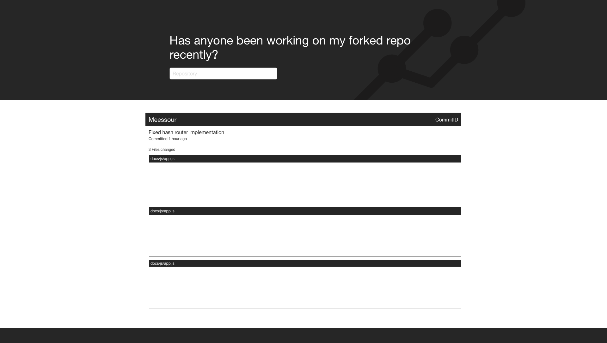

# Web app from scratch - CMD Minor 1920
Repository for the Web app from scratch course.

* [Description](#description)
* [Installing](#installing)
	* [Packages](#packages)
* [UI Design](#ui-design)

## Description
With this application you can get insight into who has forked your repository and if they have done any work on your project.

## Installing

To install this application localy type the following into your terminal
```
git clone https://github.com/damian1997/web-app-from-scratch-1920.git
npm install
```

To serve the application to your browser type the following into your terminal
```
npm run dev
```

To generate production files type the following into your terminal
```
npm run prod
```

## UI Design

### Desktop

Home page when launching the application


Commit detail page



### Mobile

Home page when launching the application


Commit detail page


<!-- Add a link to your live demo in Github Pages 🌐-->

<!-- ☝️ replace this description with a description of your own work -->

<!-- replace the code in the /docs folder with your own, so you can showcase your work with GitHub Pages 🌍 -->

<!-- Add a nice poster image here at the end of the week, showing off your shiny frontend 📸 -->

<!-- Maybe a table of contents here? 📚 -->

<!-- How about a section that describes how to install this project? 🤓 -->

<!-- ...but how does one use this project? What are its features 🤔 -->

<!-- What external data source is featured in your project and what are its properties 🌠 -->

<!-- Maybe a checklist of done stuff and stuff still on your wishlist? ✅ -->

<!-- How about a license here? 📜 (or is it a licence?) 🤷 -->
